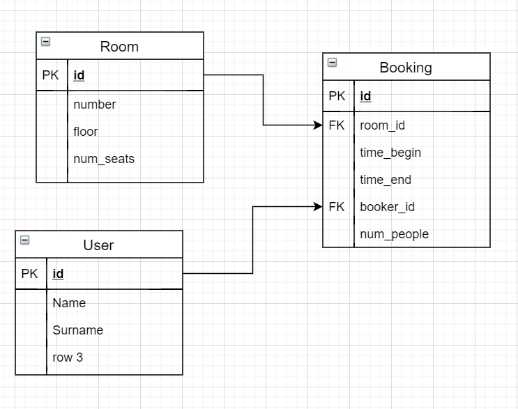

# Задание для поступления на кафедру "Корпоративные информационные системы"
## Выполнено Николаем Игнатьевым

### Постановка задачи

Напишите приложение для автоматизации бронирования помещений. Например, для бронирования учебных аудиторий или переговорных комнат в офисе. 

Реализуйте механизм рекомендаций. Например, при указании желаемого времени и числа людей - рекомендовать пользователю подходящие помещения. 

Подумайте, какие еще функции могут быть полезны и удобны для пользователей этого приложения. Реализуйте их.

Удачи!

### Дополнительные задачи

Реализовать механизм регистрации новых пользователей и входа в систему как уже существующий.

### Описание реализации

#### Используемые технологии

Язык программирования: Python 3.6

База данных: SQLite

#### ER-схема базы данных

### TODO

1. Bugfix

2. Реализовать оповещение пользователей о приближении времени брони

3. UUID для всего - оверкилл. Было реализовано с ним сейчас, чтобы id честно был уникальным. Некоторые айдишники можно реализовать через счётчики с помощью триггеров.

4. На данный момент реализовано на SQLite - переделать на серверную БД

5. Реализовать вход с помощью логина и пароля (в таблице у User должен быть свой username и password)
